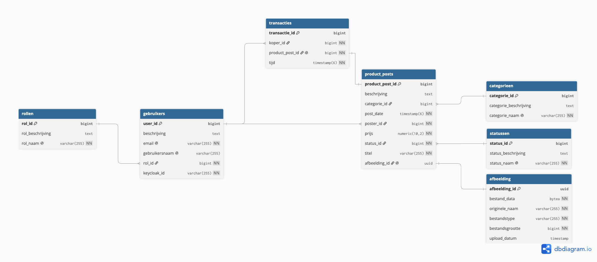

# Nepplaats - Web API

* **GitHub Repository:** <https://github.com/debbiejansen/nepplaats>


## Inhoudsopgave

1. [Stap 1: Software Checklist & Terminal Controls](#-stap-1-software-checklist--terminal-controls)

2. [Stap 2: Keycloak Setup & Terminal Execution](#-stap-2-keycloak-setup--terminal-execution)

3. [Stap 3: Architectuur & Design Principles](#-stap-3-architectuur--design-principles)

4. [Stap 4: Database Schema (ERD)](#-stap-4-database-schema-erd)

5. [Stap 5: Spring Boot Configuratie & Starten](#-stap-5-spring-boot-configuratie--starten)

6. [Stap 6: Testen & End-to-End Flow in Postman](#-stap-6-testen--end-to-end-flow-in-postman)

7. [API Endpoints Overzicht](#-api-endpoints-overzicht)

8. [Troubleshooting](#-troubleshooting)

## Stap 1: Software Checklist & Terminal Controls

Voordat je begint, controleer in de terminal of alle software correct op je machine geïnstalleerd is en draait.

### 1. Java (JDK 17+)

* **Terminal Check:**

  ```
  java -version
  
  ```

* **Verwacht resultaat:** `openjdk version "17.0.x"` (of hoger).

* **Niet geïnstalleerd?** Volg de [Adoptium Eclipse Temurin Installatiehandleiding](https://adoptium.net/installation/).

### 2. PostgreSQL & Database

Check of je een database hebt die Postgres heet.

* **Verwacht resultaat:** Een lijst van databases op je lokale PostgreSQL-instantie.

* **Niet geïnstalleerd?** Volg de [PostgreSQL Download & Installation Guide](https://www.postgresql.org/download/). Zorg dat er een database genaamd `postgres` op poort `5432` aanwezig is.

### 3. Keycloak (Standalone / Terminal)

Check of je Keycloak gedownload/geinstalleerd hebt.

* **Niet geïnstalleerd?** Download Keycloak via de [Keycloak Downloads](https://www.keycloak.org/downloads) (kies voor Keycloak Server zip/tar.gz).

### 4. Postman

* **Check:** Zoek Postman in je applicatie-overzicht.

* **Niet geïnstalleerd?** Download en installeer via [Postman Downloads](https://www.postman.com/downloads/).

## Stap 2: Keycloak Setup & Import

De applicatie maakt gebruik van Keycloak voor authenticatie en autorisatie. Gebruikers worden **niet** handmatig via de REST API geregistreerd. In plaats daarvan log je in via Keycloak, waarna Spring Boot bij het eerste request (op basis van het JWT Bearer token) de gebruiker automatisch synchroniseert met PostgreSQL (`getOrCreateGebruikerFromJwt`).

Het project bevat een kant-en-klaar exportbestand (`nepplaats/config/realm-export.json`) met daarin de juiste Client ID (`nepplaats-backend`), rollen (`ADMIN`, `USER`) én ingestelde testgebruikers.

---

### Optie A: Keycloak starten én automatisch importeren via Terminal (Aanbevolen)

1. **Kopieer het exportbestand naar je Keycloak-map:**  
   Plaats de file `nepplaats/config/realm-export.json` uit dit project direct in de `data/import/` map van je gedownloade Keycloak-installatie. *(Maak de map `import` aan als deze nog niet bestaat).*

2. **Start Keycloak met de `--import-realm` vlag op poort 9090:**

    * **Linux / macOS:**
      ```bash
      ./bin/kc.sh start-dev --http-port=9090 --import-realm
      ```

    * **Windows (PowerShell / Command Prompt):**
      ```cmd
      .\bin\kc.bat start-dev --http-port=9090 --import-realm
      ```

> **Let op:** Keycloak zal bij het opstarten automatisch het bestand `data/import/realm-export.json` detecteren en de volledige `master` realm (inclusief client en gebruikers) importeren.

---

### Optie B: Handmatig importeren via de Keycloak Admin Console (UI)

Als je Keycloak al hebt draaien op poort `9090`:

1. Ga naar de **Keycloak Admin Console** op [http://localhost:9090](http://localhost:9090).
2. Log in met je admin-gegevens.
3. Klik linksboven op de dropdown voor **Realm selection** (staat standaard op `Master`).
4. Klik op **Create Realm** (of **Import Realm**).
5. Klik op **Browse...** bij *Resource File* en selecteer `nepplaats/config/realm-export.json`.
6. Klik op **Create** / **Save**.

---

* **Issuer URI:** `http://localhost:9090/realms/master`

* **Client ID:** `nepplaats-backend`

* **Client Roles:** `ADMIN` (gekoppeld aan rol_id 1) en `USER` (gekoppeld aan rol_id 2)

## Stap 3: Architectuur & Design Principles

De backend volgt het N-tier Layered Architecture patroon (**DTO - Controller - Service - Repository - Entity**).

```
[ Client / Postman ]
        │ (HTTP Request + Bearer JWT)
        ▼
[ Controller Layer ]  ──> Valideert HTTP DTO requests
        │
        ▼
[  Service Layer   ]  ──> Uitvoeren business logica & JWT Sync (getOrCreateGebruikerFromJwt)
        │
        ▼
[ Repository Layer]  ──> Spring Data JPA / JPQL Database Abstractie
        │
        ▼
[  Database (PG)   ]  ──> PostgreSQL Tabellen

```

### Componenten & Best Practices:

1. **Controller Layer (`ProductPostController`, `AfbeeldingController`):** Afhandeling van inkomende HTTP requests en response status codes.

2. **DTO Layer (`ProductPostDto`):** Garandeert databescherming door interne databasemodellen te scheiden van de representatie op de API.

3. **Service Layer (`ProductPostService`, `GebruikerService`):** Bevat alle bedrijfsslogica, zoals het bepalen van de rol via de JWT claims en het synchroniseren van de Keycloak-gebruiker naar PostgreSQL.

4. **Repository Layer (`GebruikerRepository`, etc.):** Vraagt data op via Spring Data JPA.

5. **Entity Layer (`Gebruiker`, `ProductPost`, etc.):** JPA-annotaties gekoppeld aan de PostgreSQL tabellen.

## Database Schema (ERD)

De database-structuur staat beschreven in `nepplaats_v2.sql` en wordt door Spring Boot automatisch geladen bij het starten.




## Stap 4: Applicatie starten in terminal:

```
git clone https://github.com/debbiejansen/nepplaats.git
cd nepplaats

# Start applicatie via Maven wrapper
./mvnw spring-boot:run

```

## Stap 5: Testen & End-to-End Flow in Postman

### Step 1: Inloggen via Keycloak in Postman

1. Open Postman en maak een nieuwe request aan.

2. Ga naar het tabblad **Authorization**.

3. Vul de gegevens in:

    * **Type:** `OAuth 2.0`

    * **Grant Type:** `Password Credentials`

    * **Access Token URL:** `http://localhost:9090/realms/master/protocol/openid-connect/token`

    * **Client ID:** `nepplaats-backend`

    * **Username:** `<jouw-keycloak-gebruikersnaam>`

    * **Password:** `<jouw-keycloak-wachtwoord>`

4. Klik op **Get New Access Token** en daarna op **Use Token**.

5. Schakel SSL Verification uit in Postman: `Settings -> General -> SSL certificate verification -> OFF`.

### Step 2: Maak een Afbeelding & ProductPost Aan

#### 1. Upload een Afbeelding

* **Method:** `POST`

* **URL:** `https://localhost:8443/api/afbeeldingen/upload`

* **Body:** `form-data` -> Key: `file` (type File), kies een afbeelding.

* **Response:** Kopieer het `afbeelding_id` (UUID) uit de JSON response.

#### 2. Maak de ProductPost aan

* **Method:** `POST`

* **URL:** `https://localhost:8443/api/productposts`

* **Headers:** `Content-Type: application/json`

* **Body (raw JSON):**

```
{
  "titel": "Vintage Fiets",
  "beschrijving": "Mooie stadsfiets in uitstekende staat.",
  "prijs": 150.00,
  "categorieId": 1,
  "statusId": 1,
  "posterId": 1,
  "afbeeldingId": "PLAATS_HIER_JE_GEKOPIEERDE_UUID"
}

```

## API Endpoints Overzicht

### Zodra de API runt kun je hier de endpoints inzien
* **URL:** 'https://localhost:8443/swagger-ui/index.html'

## Troubleshooting

* **`SSL Certificate Error` in Postman:**
  De applicatie maakt gebruik van HTTPS op poort 8443 met een lokaal certificaat (`nepplaats.p12`). Schakel *SSL Certificate Verification* uit in de instellingen van Postman.

* **Keycloak Port Conflict (9090):**
  Controleer of er geen andere applicatie draait op poort 9090 met `netstat -ano | findstr 9090` (Windows) of `lsof -i :9090` (macOS/Linux).

* **`401 Unauthorized` / `403 Forbidden`:**
  Controleer of je Bearer Token nog geldig is en of de gebruiker in Keycloak beschikt over de vereiste clientrol (`ADMIN` of `USER`) binnen de client `nepplaats-backend`.


* **'keycloak web login:'**
* **URL:** 'http://localhost:9090/realms/master/protocol/openid-connect/auth?client_id=nepplaats-backend&response_type=code&redirect_uri=https://oauth.pstmn.io/v1/callback&scope=openid%20profile%20email'